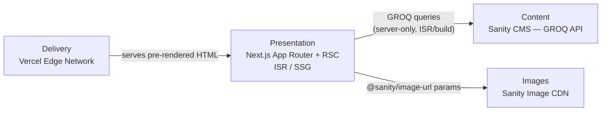
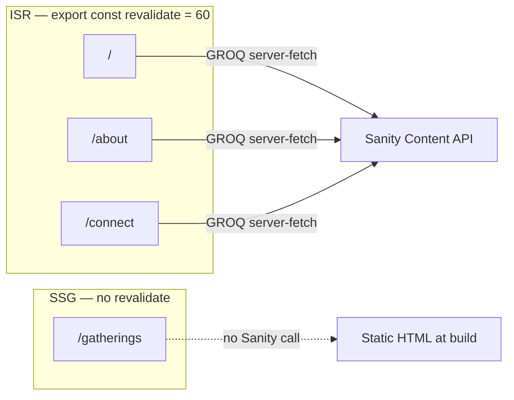
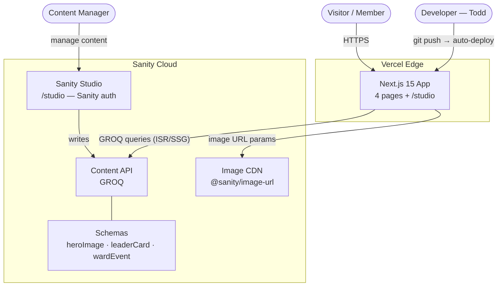

# Architecture Spine — Tooele YSA Ward Website

## Design Paradigm

**Headless CMS Jamstack** with strict content-boundary layering. Three layers; dependency flows in one direction only.



Layers map to directories:

| Layer                      | Directory                 |
| -------------------------- | ------------------------- |
| Presentation — pages       | `app/(site)/`             |
| Presentation — components  | `components/`             |
| Presentation — data access | `lib/sanity/`             |
| Content — schemas          | `sanity/schema-types/`    |
| Content — studio config    | `sanity/sanity.config.ts` |
| Static assets              | `public/`                 |

## Invariants & Rules

### AD-1 — Headless CMS Jamstack layer boundary

- **Binds:** all
- **Prevents:** Sanity schema changes coupling to Next.js routing; Next.js writing to Sanity outside Studio; CMS data fetched client-side
- **Rule:** Presentation depends on Content API (GROQ); Content has zero knowledge of Presentation. No component issues mutations to Sanity; all writes go through Sanity Studio exclusively.

### AD-2 — Per-route rendering strategy

- **Binds:** FR-1, FR-3, FR-5 through FR-17, NFR-3
- **Prevents:** a CMS-dependent page being frozen static forever; Gatherings pulling a runtime CMS call it doesn't need
- **Rule:** `/gatherings` is SSG — no `revalidate` export, no GROQ call. `/`, `/about`, `/connect` are ISR — each page module exports `export const revalidate = 60`. No page uses dynamic `(force-dynamic)` rendering. `/studio` is excluded from the static/ISR contract.



### AD-3 — Server-only CMS data fetching

- **Binds:** FR-1, FR-9, FR-14, NFR-9
- **Prevents:** `SANITY_API_READ_TOKEN` leaking to the client bundle; client-side CMS polling adding latency
- **Rule:** All GROQ queries execute in React Server Components or at build time only. `SANITY_API_READ_TOKEN` is a server-side env var — never prefixed `NEXT_PUBLIC_`. Only `NEXT_PUBLIC_SANITY_PROJECT_ID` and `NEXT_PUBLIC_SANITY_DATASET` are client-safe.

### AD-4 — next-sanity is the sole Sanity integration layer

- **Binds:** FR-1, FR-9, FR-14
- **Prevents:** two implementation paths hitting the Sanity API with divergent caching, error handling, or token usage
- **Rule:** All GROQ queries and client configuration go through `next-sanity`. No raw `fetch()` to `https://PROJECT.api.sanity.io`. All queries are named exports from `lib/sanity/queries.ts`; no inline query strings in page files.

### AD-5 — Sanity CDN owns all image transformation; `sanity-image.tsx` is the mandatory wrapper

- **Binds:** FR-1 (hero carousel), FR-9 (leader card images), NFR-1, NFR-2
- **Prevents:** Vercel Image Optimization chained after Sanity CDN; raw `` or un-configured `next/image` with Sanity URLs; inconsistent crop/format params across components
- **Rule:** Every Sanity-sourced image must render through `components/sanity-image.tsx`. That wrapper uses `@sanity/image-url` v2 builder with explicit `width`, `.format('webp')`, and `.quality(80)` params; `next/image` is configured with a Sanity CDN loader so Vercel's optimizer is bypassed. No component renders a Sanity asset URL via raw `` or un-wrapped `next/image`. `heroImage` schema field uses `type: 'image'` with `hotspot: true`. Static assets in `public/` (floor plan, app icons) use `next/image` with the default Vercel optimizer.

### AD-6 — No auth surface in Next.js

- **Binds:** all routes, NFR-8
- **Prevents:** auth middleware accidentally blocking public pages; a second session system layered on Sanity Studio
- **Rule:** All Next.js routes are public. `/studio` uses Sanity's built-in auth exclusively — no `middleware.ts` auth check, no JWT/session handling in the Next.js layer.

### AD-7 — Vercel auto-deploy; secrets in dashboard only

- **Binds:** all, A-10, NFR-8, NFR-9
- **Prevents:** secrets committed to the repo; manual deploy steps; divergent deployment targets
- **Rule:** `main` branch auto-deploys to Vercel production. PR branches deploy to Vercel preview. The four required env vars (`SANITY_API_READ_TOKEN`, `NEXT_PUBLIC_SANITY_PROJECT_ID`, `NEXT_PUBLIC_SANITY_DATASET`, `NEXT_PUBLIC_SANITY_STUDIO_URL`) are set in the Vercel project dashboard only — never in `.env.local` committed to the repo.

### AD-8 — Tailwind CSS v4 only; tokens live in `globals.css @theme`; no component library

- **Binds:** all UI components, NFR-6
- **Prevents:** a second design system (shadcn, MUI, Radix) introducing tokens that conflict with DESIGN.md; using Tailwind v3 config patterns (a `tailwind.config.ts` extension file) that break under v4's CSS-first build
- **Rule:** All styling is Tailwind v4 utility classes. No component library is installed. Tailwind v4 is configured CSS-first: `@import "tailwindcss"` in `globals.css`, with all DESIGN.md color/typography/spacing tokens declared in a `@theme {}` block in that same file — not in a JS config file. DESIGN.md wins on any visual conflict.

### AD-9 — Sanity client is a singleton with fixed configuration

- **Binds:** FR-1, FR-9, FR-14; all GROQ data access
- **Prevents:** two pages constructing Sanity clients with different `apiVersion`, `useCdn`, or `perspective` values that return different data shapes or caching behavior
- **Rule:** One client instance is exported from `lib/sanity/client.ts`. Required params: `apiVersion` set to the scaffold date (ISO format, e.g. `'2026-07-01'`); `useCdn: true` for production reads; `perspective: 'published'`; `dataset` and `projectId` from env vars. All page and component files import this singleton — they never call `createClient()` themselves.

### AD-10 — Sanity schema field type contracts

- **Binds:** `sanity/schema-types/`; `lib/types.ts`; all CMS-dependent components
- **Prevents:** `wardEvent` schema using Sanity `date` type (YYYY-MM-DD string) when the component expects a full ISO timestamp for time display; `heroImage` schema omitting `hotspot` so crop-aware image rendering breaks
- **Rule:** `wardEvent.dateTime` is Sanity type `datetime` (full ISO 8601 timestamp). `heroImage.image` is Sanity type `image` with `options: { hotspot: true }`. `leaderCard.phone` and `leaderCard.email` are Sanity type `string`, marked optional (`validation: Rule => Rule.optional()`). These field contracts are the boundary between Content and Presentation — neither side may assume a different shape.

### AD-11 — TypeScript strict mode; `sanity-typegen` for schema-derived types

- **Binds:** all TypeScript files
- **Prevents:** `any` in component props allowing mismatched Sanity document shapes to slip through; hand-authored types in `lib/types.ts` diverging from the actual Sanity schema over time
- **Rule:** `tsconfig.json` sets `"strict": true`. No `any` is permitted (use `unknown` + type guard if needed). Sanity document TypeScript types are generated via `sanity-typegen` from the schema — not hand-authored — and live in `lib/types.ts`. Regenerate types whenever a schema field changes.

### AD-12 — ISR page GROQ error handling: return empty, never throw

- **Binds:** all ISR pages (`/`, `/about`, `/connect`)
- **Prevents:** a GROQ fetch failure causing a Next.js 500 (unhandled throw in RSC) on one ISR page while other pages handle it differently
- **Rule:** Every Server Component GROQ fetch is wrapped in `try/catch`. On catch, return an empty array (or the equivalent empty type) and let the component render its established empty state (per EXPERIENCE.md). Do not re-throw. Do not show an error boundary in v1 — the graceful empty state is the contract.

## Consistency Conventions

| Concern          | Convention                                                                                                                         |
| ---------------- | ---------------------------------------------------------------------------------------------------------------------------------- |
| File naming      | Components: `kebab-case.tsx`. Directories: `kebab-case/`. Route segments follow Next.js App Router conventions.                    |
| Component naming | PascalCase exports. One component per file.                                                                                        |
| GROQ queries     | Named exports from `lib/sanity/queries.ts` only. Prefixed by domain: `heroImagesQuery`, `leaderCardsQuery`, `upcomingEventsQuery`. |
| TypeScript types | Generated by `sanity-typegen` from schema; live in `lib/types.ts`. No `any`; `tsconfig.json` `strict: true` (AD-11).               |
| Env vars         | Server-only: no `NEXT_PUBLIC_` prefix. Client-safe: `NEXT_PUBLIC_` prefix. No secrets in source.                                   |
| External links   | `target="_blank" rel="noopener noreferrer"` on every external link — no exceptions (enforced in components, not inline JSX).       |
| ISR declaration  | `export const revalidate = 60` at the top of each ISR page module. Never use `force-dynamic`.                                      |
| Image alt text   | All images have non-empty `alt`; decorative images use `alt=""` and `role="presentation"`.                                         |
| Tap targets      | Minimum 44×44 CSS px for all interactive elements (WCAG 2.1 AA, NFR-4).                                                            |
| Empty states     | CMS-driven sections always render a graceful empty state (specified in EXPERIENCE.md) when Sanity returns an empty array.          |

## Stack

[ASSUMPTION] Verify pinned versions before scaffolding — these are current as of architecture authoring.

| Name                     | Version                      |
| ------------------------ | ---------------------------- |
| Next.js                  | 15.x                         |
| TypeScript               | 5.x                          |
| Tailwind CSS             | 4.x                          |
| Sanity Studio (embedded) | 3.x                          |
| next-sanity              | 9.x [ASSUMPTION — verify]    |
| @sanity/image-url        | 1.x [ASSUMPTION — verify]    |
| Node.js (Vercel runtime) | 22 LTS [ASSUMPTION — verify] |
| Vercel                   | platform (no version)        |

**Developer tooling (not runtime):** Sanity MCP — configured to allow Copilot/Claude to interact with Sanity schemas and Content API during development. No effect on production.

## Structural Seed

```text
tooele-ysa/
  app/
    (site)/                       # Public route group — shares SiteNav + Footer shell
      layout.tsx                  # Site nav + footer; font + color vars
      page.tsx                    # Home /  (ISR revalidate=60)
      gatherings/
        page.tsx                  # Gatherings /gatherings  (SSG)
      about/
        page.tsx                  # About Us /about  (ISR revalidate=60)
      connect/
        page.tsx                  # Let's Connect /connect  (ISR revalidate=60)
    studio/
      [[...tool]]/
        page.tsx                  # Embedded Sanity Studio — Sanity auth only
    layout.tsx                    # Root layout: <html>, globals.css, font loading
    globals.css                    # @import "tailwindcss"; @theme { all DESIGN.md tokens } (Tailwind v4 CSS-first)
  components/
    site-nav.tsx                  # Sticky top nav + mobile hamburger drawer
    footer.tsx                    # Dark footer band
    hero-carousel.tsx             # Auto-advancing carousel; 0/1/2+ image states
    leader-card.tsx               # CMS-driven; optional phone/email; graceful empty
    event-item.tsx                # CMS-driven; date + title required; optional desc/loc
    app-link-card.tsx             # Static LDS app + social link cards
    missionaries-block.tsx        # Fully static; tel: + Church link
    sanity-image.tsx              # next/image + Sanity CDN loader wrapper
  lib/
    sanity/
      client.ts                   # next-sanity createClient (project ID, dataset, token)
      queries.ts                  # All GROQ named exports
      image.ts                    # @sanity/image-url builder instance
    types.ts                      # TypeScript types for Sanity document shapes
  sanity/
    schema-types/
      hero-image.ts               # { _type, image, order }
      leader-card.ts              # { _type, name, title, phone?, email? }
      ward-event.ts               # { _type, title, dateTime, description?, location? }
      index.ts                    # schemaTypes array export
    sanity.config.ts              # Sanity Studio config (project ID, dataset, plugins)
  public/
    images/
      floor-plan.*                # Static building layout (supplied by Todd at build)
      app-icons/                  # LDS app icon PNGs/SVGs
  next.config.ts                  # Sanity image remote pattern; no other dynamic config
  .env.local                      # Local dev only — NOT committed
  .env.example                    # Template listing required env var names (committed)
```

**System view:**



## Capability → Architecture Map

| Capability / FR                  | Lives in                                                    | Governed by                                              |
| -------------------------------- | ----------------------------------------------------------- | -------------------------------------------------------- |
| FR-1 Hero Carousel               | `app/(site)/page.tsx` + `components/hero-carousel.tsx`      | AD-2 (ISR), AD-3 (RSC), AD-4 (next-sanity), AD-5 (CDN)   |
| FR-2 Tagline                     | `app/(site)/page.tsx` (static JSX)                          | AD-2 (SSG-within-ISR)                                    |
| FR-3 Static content blocks       | `app/(site)/page.tsx`                                       | AD-2                                                     |
| FR-4 Google Maps CTA             | `app/(site)/page.tsx`                                       | Convention: external link rule                           |
| FR-5–8 Gatherings content        | `app/(site)/gatherings/page.tsx`                            | AD-2 (SSG)                                               |
| FR-9–10 Leadership Directory     | `app/(site)/about/page.tsx` + `components/leader-card.tsx`  | AD-2 (ISR), AD-3 (RSC), AD-4, AD-5                       |
| FR-11 Missionaries block         | `components/missionaries-block.tsx`                         | AD-6 (no auth); fully static                             |
| FR-12 LDS App links              | `components/app-link-card.tsx`                              | Convention: external link rule                           |
| FR-13 Social links (Coming Soon) | `components/app-link-card.tsx`                              | AD-8 (Tailwind state); OQ-1, OQ-2                        |
| FR-14–15 Events Calendar         | `app/(site)/connect/page.tsx` + `components/event-item.tsx` | AD-2 (ISR), AD-3 (RSC), AD-4, AD-10, AD-12               |
| FR-16 Global navigation          | `components/site-nav.tsx`                                   | AD-8 (Tailwind); Convention: active link                 |
| FR-17 Footer                     | `components/footer.tsx`                                     | AD-8 (Tailwind)                                          |
| Sanity content schemas           | `sanity/schema-types/`                                      | AD-1 (boundary), AD-10 (field type contracts)            |
| Sanity Studio                    | `app/studio/[[...tool]]/page.tsx`                           | AD-6 (Sanity auth only)                                  |
| Image delivery                   | `components/sanity-image.tsx` + `lib/sanity/image.ts`       | AD-5 (CDN, mandatory wrapper)                            |
| GROQ data access                 | `lib/sanity/client.ts` + `lib/sanity/queries.ts`            | AD-3 (server-only), AD-4 (next-sanity), AD-9 (singleton) |
| TypeScript types                 | `lib/types.ts` (sanity-typegen output)                      | AD-11 (strict, typegen)                                  |
| Environment / secrets            | Vercel dashboard + `.env.example`                           | AD-3 (token boundary), AD-7 (no secrets in repo)         |

## Deferred

| What                                    | Why it can wait                                                                                                                                     |
| --------------------------------------- | --------------------------------------------------------------------------------------------------------------------------------------------------- |
| On-demand ISR via Sanity webhooks       | Upgrades 60s polling to near-instant revalidation. Adds a webhook handler route and Vercel secret. Deferred until 60s lag is a real user complaint. |
| Social media handles (OQ-1, OQ-2)       | Cards are built with "Coming Soon" state; activate when handles are confirmed.                                                                      |
| Missionary phone number (OQ-3)          | Placeholder at build; Todd to supply before About Us ships.                                                                                         |
| `/events/[slug]` event detail routes    | PRD A-8 — inline display is sufficient for v1. Deferred to v2.                                                                                      |
| CMS-managed classroom assignments       | PRD FR-7 — static for v1; escalate if assignments change more than quarterly.                                                                       |
| Hero image scheduled publish            | PRD out of scope — images go live on Publish in Sanity.                                                                                             |
| Sanity live preview / Presentation Tool | No editor preview requirement in v1; add when Content Manager requests it.                                                                          |
| Pagination / infinite scroll for events | EXPERIENCE.md — Content Manager keeps list trim; 20-event cap in GROQ query.                                                                        |
| Media archive / sermon recordings       | PRD non-user — out of scope for this site entirely.                                                                                                 |
